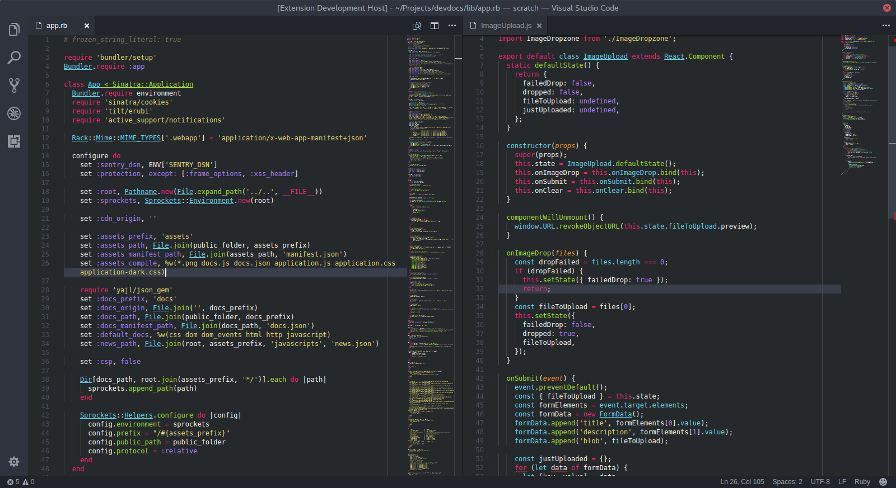

# One Dark Flatland Monokai Theme for VSCode

Flatland Monokai syntax colors with a One Dark colors for the editor shell. Is a high contrast dark theme with the classic Monokai look. Blends nicely with the [Arc Theme](https://github.com/horst3180/arc-theme) on Linux.

Based off [VSCode One Monokai theme](https://github.com/azemoh/vscode-one-monokai) and [Flatland Monokai Theme](https://marketplace.visualstudio.com/items?itemName=gerane.Theme-FlatlandMonokai).

## Install
Press Ctrl/Command + Shift + P to launch the command palette then run `ext install one-dark-flatland-monokai`, or type `install extensions` and search for One Dark Flatland Monokai in the VS Code Marketplace.

## Screenshot
Screenshot of Ruby and JavaScript

If you like this theme checkout [One Dark Theme](https://marketplace.visualstudio.com/items?itemName=azemoh.theme-onedark)
